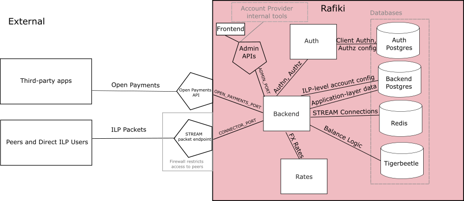

# Rafiki Architecture

Rafiki is a collection of four applications that are run together; each one can be scaled horizontally. These applications are 

* [`backend`](../packages/backend): The main application handling business logic and external communication 
* [`auth`](../packages/auth): Authorization and authentication
* [`rates`](../packages/rates): Exchange rates and fees
* [`frontend`](../packages/frontend): Internal admin service

These applications rely on four databases:

* A postgres database used by the `backend`
* A separate postgres database used by `auth`.
* [Tigerbeetle](https://github.com/coilhq/tigerbeetle) used by `backend` for accounting balances at the ILP layer.
* Redis used by `backend` as a cache to share STREAM connection details across processes.

## Backend

The `backend` application has four responsibilities: 

* Expose Open Payments API endpoints for public clients to perform account management tasks.
* Expose an internal Admin API for service operators to manage accounts and application settings like peering relationships.
* Expose an ILP server to send and receive STREAM packets with peers.
* Business logic to manage accounts and track balances.

The `backend`'s ILP functionality includes:

- Accepting ILP packets over an HTTP interface and authenticating them against ILP account credentials
- Routing ILP packets to the correct destination account
- Converting currencies 
- Sending out ILP packets over HTTP for destinations that are not local
- Fulfilling packets with an internal STREAM server

## Auth

The `auth` service performs authorization and authentication of incoming requests. For requests from entities that have
accounts within the local instance of Rafiki, the `auth` service uses data stored in the auth postgres database. For requests
from clients registered with other instances of Rafiki, the auth service resolves the client's public key from its source
and uses it to authenticate and authorize the request.

## Rates

The `rates` application in this repo is a placeholder service for providing exchange rates between assets. It is called by the `backend` when
creating quotes. It is intended for development use while working on Rafiki; anyone deploying Rafiki to production should implement a
rates service appropriate to their use case.

## Frontend

The frontend will host the internal admin interface. The current application is a placeholder.
